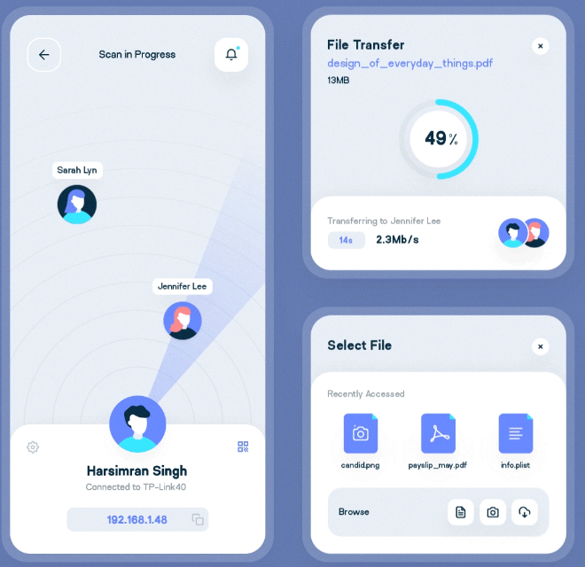

# myftp — LanLink

A peer-to-peer file and folder transfer app for devices on the same local
network. One machine picks a peer on a radar screen, chooses files or a whole
folder, and the other machine accepts — no server, no cloud, no internet.



* **UI** — Flet 1.0 (`src/main.py` → `src/app/`), desktop or browser.
* **Transport** — `src/lanlink/`, a stdlib-only library: UDP beacons find
  peers, one TCP connection moves the bytes.

---

## Install and run

Requires Python 3.10+ and [uv](https://docs.astral.sh/uv/).

```bash
uv sync              # install dependencies (creates .venv + uv.lock)
uv run flet run      # desktop app, with hot reload
uv run flet run --web   # browser UI on http://localhost:8511
```

Always prefix with `uv run` — that guarantees you get *this* project's pinned
Flet, not whatever happens to be installed globally.

---

## How to use it

Run the app on **both** machines. It only talks to devices on the same LAN.

### 1. Give yourself a name

The card under the radar shows your nickname and IP address.

* Type into the **"Change name here"** field — the name is saved as you type
  and peers see it immediately (first run is called `unnamed`).
* Tap the IP pill to copy your address.
* The **gear** opens Settings: your peer id, where received files land, and
  how many recent paths are remembered.
* The **list** button opens *Nearby peers* — the same radar as a list, with a
  Select button per device. Useful when many devices are around.

### 2. Wait for the radar to find devices

The top bar reads **Scan in Progress** while searching and **Choose a Peer**
once something is found. Markers appear on the rings.

Peers beacon every 3 seconds and are forgotten 12 seconds after their last
beacon — close the app on the other device and its marker disappears on its
own (with it, the action panel, so you are never offered a "send again"
button for a device that has left).

### 3. Select exactly one peer

Tap a marker (or Select in *Nearby peers*). The top bar switches to
**Peer Selected** and the action panel slides in — that panel only exists
once a peer is picked, so the radar gets the full screen while scanning.

Tap the marker again, or **Back**, to deselect.

### 4. Send files or a folder

1. **Send files** opens the *Select File* sheet:
   * **Browse** — pick one or more files,
   * **Pick a folder** — send a directory with its contents,
   * **Recently Accessed** — the last 12 paths you picked (they persist
     between runs).
2. The card shows what is queued under **Ready to send**. **Transfer** starts
   the call; **Change** goes back to the picker.
3. The other side gets an **Incoming transfer** prompt listing what is coming.
   *Nothing moves until they press **Accept**.* Declining shows the sender
   **"They declined the transfer"**, and nothing is written.
4. A progress ring tracks the transfer. **Cancel** is available while
   ringing, **Cancel transfer** while bytes are moving.
5. **Transfer complete** offers **Send more files** (stays with the same
   peer) or **Back to radar**.

### 5. Receive

Accepted transfers are written to a fresh folder per transfer:

```
~/Downloads/LanLink/<sender-name>_<YYYYmmdd-HHMMSS>/
```

The folder name is uniquified if one already exists, and the exact location
is shown in Settings under *Receive to*.

### History

The **clock** icon in the top bar lists this session's transfers — the latest
eight, each with a success/failure mark, the label, peer, size, duration and
time of day.

---

## Good to know

* **Same network only.** Discovery uses UDP multicast and broadcast on port
  **47555**; transfers use TCP **47554**. Allow both through the firewall.
  Networks with AP/client isolation (common on guest Wi-Fi and some routers)
  block peer-to-peer traffic — use a normal LAN.
* **Persistence:** peer id, nickname and recents live in
  `~/.config/lanlink/identity.json` (honours `$XDG_CONFIG_HOME`).
* **Web mode** runs the whole app on the machine that started it — the
  browser only renders the UI, so files are received on that machine and the
  other device must reach it over the LAN. Use the desktop build for real
  transfers on two separate computers.
* **Layout** adapts: a narrow window stacks the radar over the cards, a wide
  one puts the action panel in a right-hand column.

---

## Tests

```bash
uv run pytest                                        # everything
uv run pytest tests/test_models.py -k name           # one file / one test
```

Tests import `lanlink` and `app` straight from `src/` (`pythonpath` in
`pyproject.toml`), and async tests need no decorator (`asyncio_mode = "auto"`).
The suite covers the transfer state machine, radar layout, config persistence
and the `RadarSweep` control — including the Flet patch deltas that decide
when it starts and stops animating.

---

## Build a package

```bash
uv run flet build linux -v      # also: windows, macos, apk, ipa, web
```

See the Flet packaging guides for signing and store submission:
[Android](https://flet.dev/docs/publish/android/),
[iOS](https://flet.dev/docs/publish/ios/),
[macOS](https://flet.dev/docs/publish/macos/),
[Linux](https://flet.dev/docs/publish/linux/),
[Windows](https://flet.dev/docs/publish/windows/),
[Web](https://flet.dev/docs/publish/web/).

---

## Project layout

```
src/main.py        entry point — hands the page to the app controller
src/app/           Flet UI, viewmodels, config (imports lanlink)
  views/           radar_view.py (screen), action_card.py, dialogs.py,
                   radar_sweep.py (the reusable RadarSweep control)
  radar_vm.py      who is nearby, who is picked (no Flet, no lanlink)
  transfer_vm.py   pick → ring → transfer → done state machine
  controller.py    the only module that imports both Flet and lanlink
src/lanlink/       stdlib-only P2P library: discovery, session, errors
tests/             pytest suite
```

`lanlink` never imports Flet or the app — it can be lifted out and used on
its own.

More about the framework: [Flet docs](https://flet.dev/docs/).
